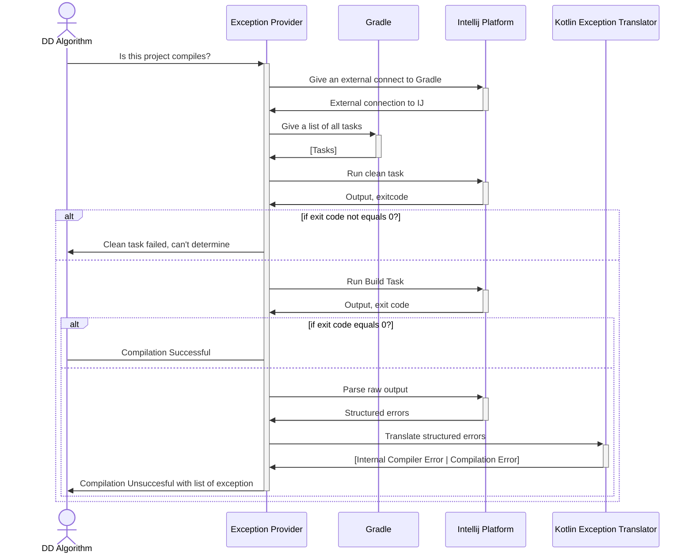

# Compilation and property checking

## Gradle

Currently, only projects that use Gradle are supported. Moreover, we haven't tested multi-module projects.

The Gradle compilation out of two main parts: running and output parsing.

### Running

#### Pipeline

For running Gradle tasks, the [GradleExceptionProvider][build-exception-provider] class is responsible. It builds the
project
in three stages:

1. the Gradle structure is parsed and all the tasks are fetched (`extractGradleTasks`)
2. the project is cleaned from the build artifacts using `clean` task (`runTask(clean)`)
3. the project is built using `build` task (**TODO: change to arbitrary task chosen by user**) (`runTask(build)`)

#### Task fetching

To fetch a list of tasks, we use the Gradle Tooling API with IDEA. `GradleExecutionHelper` provides a friendly interface
for it.

If we have any problem with collecting the information, we will suppose that isn't a Gradle project.

#### Task execution

To execute the task, the External System Runner API is used: we create a run configuration for Gradle with the necessary
task and `--quiet` flag for less output. To store the output, [GradleRunProcessAdapter][run-process-adapter] is used. It
stores stdOut/stdErr/system output. After the process has exited, the adapter asynchronously pushes the result into
`Channel` to proceed the `BuildProvider`.

### Parsing

The result of the task running is three strings with all the Gradle output, including consumed time, warnings, and
information about other executed tasks. This information leads to problems with equality, so output needs to be
additionally parsed.

The output is parsed in two stages:

#### KotlincOutputParser

The IDEA provides a generic parser of strings to `BuildEvent` for Kotlin compiler. It shrinks the output to a list of
only necessary elements: errors, its short and long description, severity, and in most cases position in the project.

To use `KotlincOutputParser` a supplementary per-line reader ([StringBuildOutputInstantReader][string-output-reader]) is
used. Any badly parsed exceptions are thrown away.

#### KotlincExceptionTranslator

However, all the exceptions are equal and not all possible fields are parsed (such as stack trace). So, we need a
self-written translator that

* Parses all useful information such as a stack trace, the rest file positions, some additional information
* Split all the exception per-category: Internal exceptions that occur because of bugs and general compilation issues (
  see [below](#kotlincexception))

So, the [KotlincExceptionTranslator][kotlinc-translator] was introduced. It parses `BuildEvent` into three (
see [KotlincException](#kotlincexception)) categories:

* The non-internal exceptions that determined using `BuildEvent.isInternal()` function. It is mostly heuristics.
* Internal exceptions are split into two categories:
    * Back-end exceptions
    * All other possible exceptions

If some parsing mistake happens, the result will be `CompilerPropertyCheckerError.CompilationSuccessful` which could be
misleading, but for now we still with it.

### KotlincException

[KotlincException][kotlinc-exception] is a sealed interface that represents all parsable errors from KotlinCompiler. The
whole list of parsable errors could be found
in [Knowledge Base article](https://youtrack.jetbrains.com/articles/PLAN-A-111/Kotlin-internal-exceptions), but now we
support only one exception:

* `org.jetbrains.kotlin.backend.common.CompilationException` is the most reproducible and easy to parse exception, so
  it's already implemented

Additionally, `KotlincException` has two classes: one for general excepted compilation error and one for unparsed
unexpected compilation error.

## Exception Transformation

After the exceptions are parsed and translated, they could be additionally transformed.
The general transformation interface is [ExceptionTransformer][exception-transformer].
It exposes an API to transform each type of exception.

Kotlinc exception transformers has following implementations:

* [PathRelativizationTransformer][path-relative-transformer] — makes paths in the exceptions relative to the projects'
  root.
  Which allows comparing the exceptions

## Exception Comparing

In the current implementation a DD Property Checker ([SameExceptionPropertyTester][same-exception-checker]) supports an
extendable checker via [ExceptionComparator][exception-comparator].
This simple interface allows comparing two exceptions to equality. 
The current implementations are
* [SimpleExceptionComparator][simple-comparator] is a comparator that uses Kotlin `equals()` for comparison.

[build-exception-provider]: ../project-minimization-plugin/src/main/kotlin/org/plan/research/minimization/plugin/execution/gradle/GradleBuildExceptionProvider.kt

[run-process-adapter]: ../project-minimization-plugin/src/main/kotlin/org/plan/research/minimization/plugin/execution/gradle/GradleRunProcessAdapter.kt

[string-output-reader]: ../project-minimization-plugin/src/main/kotlin/org/plan/research/minimization/plugin/execution/gradle/GradleBuildExceptionProvider.kt

[kotlinc-translator]: ../project-minimization-plugin/src/main/kotlin/org/plan/research/minimization/plugin/execution/exception/KotlincExceptionTranslator.kt

[kotlinc-exception]: ../project-minimization-plugin/src/main/kotlin/org/plan/research/minimization/plugin/execution/exception/KotlincException.kt

[exception-transformer]: ../project-minimization-plugin/src/main/kotlin/org/plan/research/minimization/plugin/model/exception/ExceptionTransformer.kt

[path-relative-transformer]: ../project-minimization-plugin/src/main/kotlin/org/plan/research/minimization/plugin/execution/transformer/PathRelativizationTransformer.kt

[same-exception-checker]: ../project-minimization-plugin/src/main/kotlin/org/plan/research/minimization/plugin/execution/SameExceptionPropertyTester.kt

[exception-comparator]: ../project-minimization-plugin/src/main/kotlin/org/plan/research/minimization/plugin/model/exception/ExceptionComparator.kt

[simple-comparator]: ../project-minimization-plugin/src/main/kotlin/org/plan/research/minimization/plugin/execution/comparable/SimpleExceptionComparator.kt