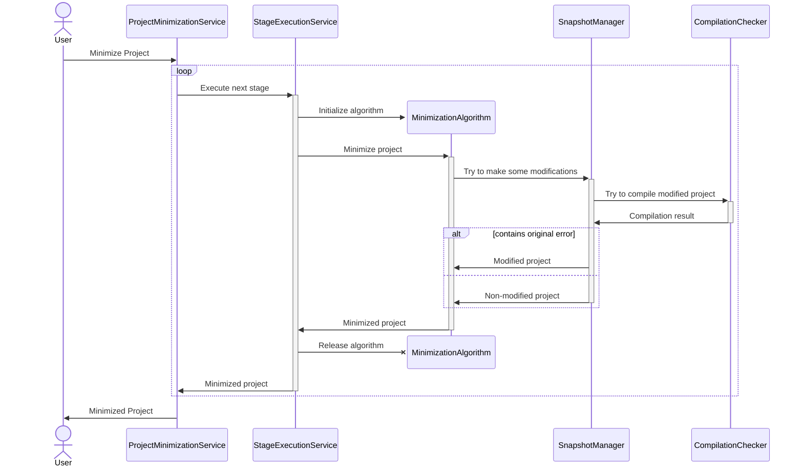

# Overall Architecture

## General Pipeline

Here is the general pipeline of project minimization.

The minimization process consists of several stages.
For instance, stage can be file-level minimization, function-level minimization or even program slicing.

At each stage, some minimization algorithm is used to minimize the project somehow. 
Any algorithm can try to apply some changes to the project using SnapshotManager, 
which can roll back any changes if they violate the target compilation error.

## Main Components

The project consists of two modules: Core and Plugin.

### Core

The core module contains Delta Debugging algorithm,
its modifications and derivatives, such as Hierarchical Delta Debugging.

Algorithms:

- **[DDMin][ddmin]** - default Delta Debugging algorithm.
- **[ProbabilisticDD][pdd]** - probabilistic Delta Debugging modification.
- **[HierarchicalDD][hdd]** - hierarchical Delta Debugging.

[ddmin]: ../project-minimization-core/src/main/kotlin/org/plan/research/minimization/core/algorithm/dd/impl/DDMin.kt
[pdd]: ../project-minimization-core/src/main/kotlin/org/plan/research/minimization/core/algorithm/dd/impl/ProbabilisticDD.kt
[hdd]: ../project-minimization-core/src/main/kotlin/org/plan/research/minimization/core/algorithm/dd/hierarchical/HierarchicalDD.kt

Interfaces that need to be implemented to use algorithms:

- **[DDItem][item]** represents a single modification in Delta Debugging algorithm.
- **[DDContext][ctx]** is an object to hold the state of the minimizing object.
- **[PropertyTester][tester]** can check whether chosen modifications (DDItems) keep the target error.
- **[HierarchicalDDGenerator][generator]** provides hierarchical structure for HDD algorithm. 
Such representation allows us to control flow the HDD algorithm in a scalable manner.

[ctx]: ../project-minimization-core/src/main/kotlin/org/plan/research/minimization/core/model/DDContext.kt
[item]: ../project-minimization-core/src/main/kotlin/org/plan/research/minimization/core/model/DDItem.kt
[tester]: ../project-minimization-core/src/main/kotlin/org/plan/research/minimization/core/model/PropertyTester.kt
[generator]: ../project-minimization-core/src/main/kotlin/org/plan/research/minimization/core/algorithm/dd/hierarchical/HierarchicalDDGenerator.kt

### Plugin
