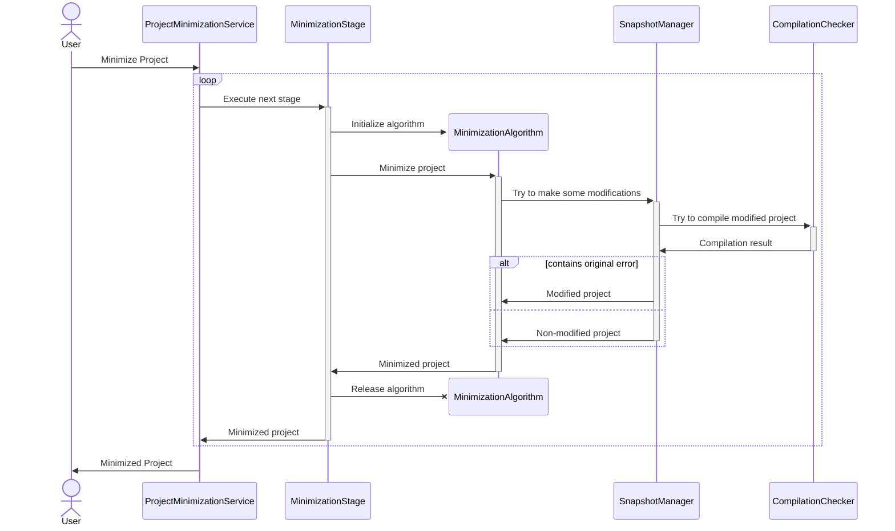

# Overall Architecture

## General Pipeline

Here is the general pipeline of project minimization.

The minimization process consists of several stages, where each stage represents some minimization algorithm.
Any algorithm can try to apply some changes to the project using SnapshotManager, 
which can roll back any changes if they violate the target compilation error.

## Main Modules and Components

The project consists of two modules: Core and Plugin.

### Core

The core module contains Delta Debugging algorithm,
its modifications and derivatives, such as Hierarchical Delta Debugging.

Algorithms:

- **[DDMin][ddmin]** - default Delta Debugging algorithm.
- **[ProbabilisticDD][pdd]** - probabilistic Delta Debugging modification.
- **[HierarchicalDD][hdd]** - hierarchical Delta Debugging.
- **[GraphDD][graphdd]** - a baseline of a graph minimization algorithm.

[ddmin]: ../project-minimization-core/src/main/kotlin/org/plan/research/minimization/core/algorithm/dd/impl/DDMin.kt
[pdd]: ../project-minimization-core/src/main/kotlin/org/plan/research/minimization/core/algorithm/dd/impl/ProbabilisticDD.kt
[hdd]: ../project-minimization-core/src/main/kotlin/org/plan/research/minimization/core/algorithm/dd/hierarchical/HierarchicalDD.kt
[graphdd]: ../project-minimization-core/src/main/kotlin/org/plan/research/minimization/core/algorithm/dd/impl/graph/GraphDD.kt

Interfaces that need to be implemented to use algorithms:

- **[DDItem][item]** represents a single modification in Delta Debugging algorithm.
- **[PropertyTester and GraphPropertyTester][tester]** can check whether chosen modifications (DDItems) keep the target error.
- **[HierarchicalDDGenerator][generator]** provides hierarchical structure for HDD algorithm. 
Such representation allows us to control flow the HDD algorithm in a scalable manner.

[item]: ../project-minimization-core/src/main/kotlin/org/plan/research/minimization/core/model/DDItem.kt
[tester]: ../project-minimization-core/src/main/kotlin/org/plan/research/minimization/core/model/PropertyTester.kt
[generator]: ../project-minimization-core/src/main/kotlin/org/plan/research/minimization/core/algorithm/dd/hierarchical/HierarchicalDDGenerator.kt

### Plugin

This module is an implementation of an IntelliJ IDEA plugin and consists of these components:

- [**Actions**](plugin/Actions.md): contains all IntelliJ IDEA actions that our plugin provides.
- [**Algorithm**](plugin/Algorithm.md): the algorithmic part of the plugin, it contains stages implementations and necessary adapters for the core module.
- **Benchmark**: the internal component for statistics collection.
- [**Compilation**](plugin/CompilationAndExceptions.md): the component for working with compilation and exceptions.
- [**Context**](plugin/Context.md): the component for working with projects as contexts, it also provides snapshot functionality.
- [**Logging**](plugin/Logging.md): provides logging functionality.
- **Modification**: implements workaround for all necessary code modifications.
- [**Services**](plugin/Services.md): contains all services of the plugin.
- [**Settings**](plugin/Settings.md): the component is responsible for the settings part of the plugin.
- **Util**: contains some useful utility functions.
