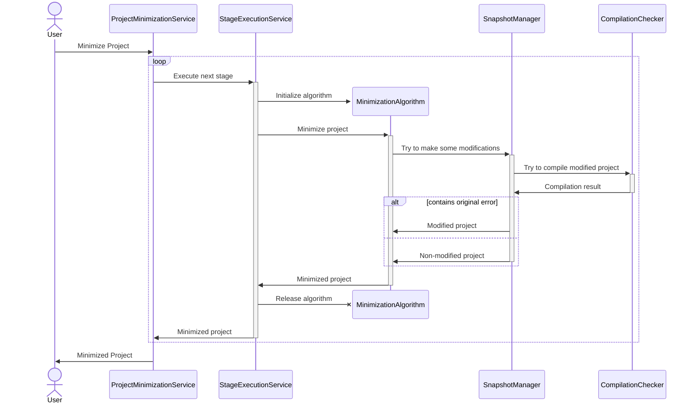

# Overall Architecture

## General Pipeline

Here is the general pipeline of project minimization.

The minimization process consists of several stages.
For instance, stage can be file-level minimization, function-level minimization or even program slicing.

At each stage, some minimization algorithm is used to minimize the project somehow. 
Any algorithm can try to apply some changes to the project using SnapshotManager, 
which can roll back any changes if they violate the target compilation error.

## Main Components

The project consists of two modules: Core and Plugin.

### Core

The core module contains Delta Debugging algorithm,
its modifications and derivatives, such as Hierarchical Delta Debugging.

Algorithms:

- **[DDMin][ddmin]** - default Delta Debugging algorithm.
- **[ProbabilisticDD][pdd]** - probabilistic Delta Debugging modification.
- **[HierarchicalDD][hdd]** - hierarchical Delta Debugging.
- **[GraphDD][graphdd]** - a baseline of a graph minimization algorithm.

[ddmin]: ../project-minimization-core/src/main/kotlin/org/plan/research/minimization/core/algorithm/dd/impl/DDMin.kt
[pdd]: ../project-minimization-core/src/main/kotlin/org/plan/research/minimization/core/algorithm/dd/impl/ProbabilisticDD.kt
[hdd]: ../project-minimization-core/src/main/kotlin/org/plan/research/minimization/core/algorithm/dd/hierarchical/HierarchicalDD.kt
[graphdd]: ../project-minimization-core/src/main/kotlin/org/plan/research/minimization/core/algorithm/dd/impl/graph/GraphDD.kt

Interfaces that need to be implemented to use algorithms:

- **[DDItem][item]** represents a single modification in Delta Debugging algorithm.
- **[PropertyTester and GraphPropertyTester][tester]** can check whether chosen modifications (DDItems) keep the target error.
- **[HierarchicalDDGenerator][generator]** provides hierarchical structure for HDD algorithm. 
Such representation allows us to control flow the HDD algorithm in a scalable manner.

[item]: ../project-minimization-core/src/main/kotlin/org/plan/research/minimization/core/model/DDItem.kt
[tester]: ../project-minimization-core/src/main/kotlin/org/plan/research/minimization/core/model/PropertyTester.kt
[generator]: ../project-minimization-core/src/main/kotlin/org/plan/research/minimization/core/algorithm/dd/hierarchical/HierarchicalDDGenerator.kt

### Plugin

This module is an implementation of an IntelliJ IDEA plugin.

- **IJDDItem.**
Project's components are represented as [IJDDItem][ij-item], which has such inherited classes:
  - **[ProjectFileDDItem][proj-file-item]** represents any file of the project.
  - **[PsiDDItem][psi-item]** represents a psi element of the project in the IDEA-project-agnostic way,
  so can be reused across different instances of the same project.

- **IJDDContext.**
The algorithm context is represented as [IJDDContext][ij-context], which contains the current minimized project.
There are several representations of the context:
  - `LightIJDDContext` represents a project as a directory where it's located.
  - `HeavyIJDDContext` represents a project as an opened IDEA project.

- **Minimization Stages.** 
As shown on the sequence diagram, the minimization process consists of minimization stages ([doc][stage-doc]).
Each stage should implement the [MinimizationStage][stage] interface.
Here are already implemented stages:
  - **[FileLevelStage][fl-stage-doc]** aims to minimize the project by deleting the project's files using HDD.

- **Snapshots.**
[SnapshotManager][snapshot] ([doc][snapshot-doc])
interface provides `transaction` method representing undoable changes performed during transaction.
Here are some implementations of SnapshotManager:
  - **[ProjectCloningSnapshotManager][project-cloning]** implements transactions base on project cloning.

- **Compilation.**
[CompilationPropertyChecker][compilation] interface provides methods for checking compilation errors of the project.

- **Settings.**
[MinimizationPluginState][state] ([doc][settings-doc]) describes settings such as minimization stages, their order and own settings for each stage.

  

[stage-doc]: MinimizationStages.md
[fl-stage-doc]: MinimizationStages.md#File-level-stage
[snapshot-doc]: SnapshotManagers.md
[settings-doc]: Settings.md

[stage]: ../project-minimization-plugin/src/main/kotlin/org/plan/research/minimization/plugin/model/MinimizationStage.kt

[ij-item]: ../project-minimization-plugin/src/main/kotlin/org/plan/research/minimization/plugin/model/item/IJDDItem.kt
[proj-file-item]: ../project-minimization-plugin/src/main/kotlin/org/plan/research/minimization/plugin/model/item/ProjectFileDDItem.kt
[psi-item]: ../project-minimization-plugin/src/main/kotlin/org/plan/research/minimization/plugin/model/item/PsiDDItem.kt

[ij-context]: ../project-minimization-plugin/src/main/kotlin/org/plan/research/minimization/plugin/model/context/IJDDContext.kt

[snapshot]: ../project-minimization-plugin/src/main/kotlin/org/plan/research/minimization/plugin/model/snapshot/SnapshotManager.kt
[project-cloning]: ../project-minimization-plugin/src/main/kotlin/org/plan/research/minimization/plugin/snapshot/ProjectCloningSnapshotManager.kt
[state]: ../project-minimization-plugin/src/main/kotlin/org/plan/research/minimization/plugin/settings/MinimizationPluginState.kt
